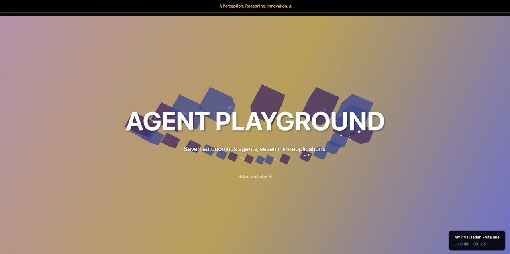

# Agent Playground

> **The future of software development isn't about what you can code—it's about what you can orchestrate.**

---

## 

This project proves a fundamental transformation in software engineering:

**Senior-level engineering skills** → **Agentic engineering skills**

Seven autonomous AI agents. One collaborative hub. Zero traditional coding constraints.

---

## 

This isn't a portfolio of hand-coded projects—it's a **proof of concept** that orchestrated AI agents can build production-quality web experiences faster, more creatively, and with more polish than traditional development workflows.

Each mini-application was built by a different AI agent:
- **Cosmos** - Interactive space visualization
- **Synth** - Audio synthesis playground
- **Chronicle** - Dynamic timeline explorer
- **Pulse** - Real-time data visualization
- **Nexus** - Network graph interactions
- **Prism** - Gradient design studio
- **Echo** - Sound wave experiments

Each agent worked independently, yet they all share components and integrate seamlessly through a unified hub.

---

## 

Built with modern web fundamentals—no frameworks, no build tools, just pure creativity:

  
  
  
  
  

- **Three.js** - 3D blockchain visualization with interactive hover effects
- **Granim.js** - Stunning animated gradient backgrounds
- **Vanilla JavaScript** - Performant, dependency-free implementations
- **Canvas API** - Custom visualizations and generative art
- **CSS3** - Smooth animations and responsive design

---

## 

**The barrier to entry for building incredible software just collapsed.**

You don't need years of experience to orchestrate agents that can:
- Build complex interactive visualizations
- Implement sophisticated UI/UX patterns
- Create pixel-perfect, responsive designs
- Integrate multiple libraries and APIs seamlessly
- Collaborate through shared codebases

You need **vision, prompt engineering, and orchestration skills.**

---

## 

Open `public/index.html` in your browser. Experience what happens when AI agents are given creative freedom, technical constraints, and a shared mission.

---

**Built by:** Amir Valizadeh ([@vitalune](https://github.com/vitalune))
**Orchestrated with:** Claude Code SDK
**Powered by:** The future of software development

  
  

